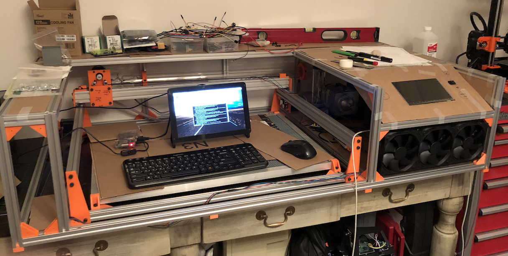
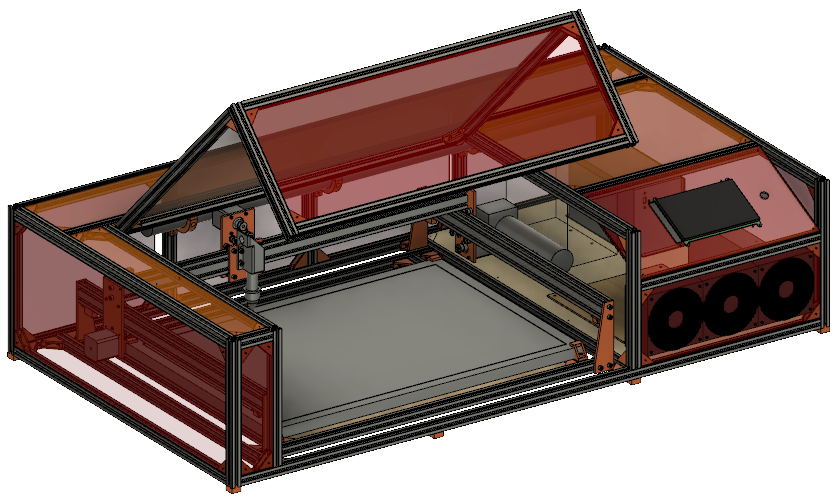
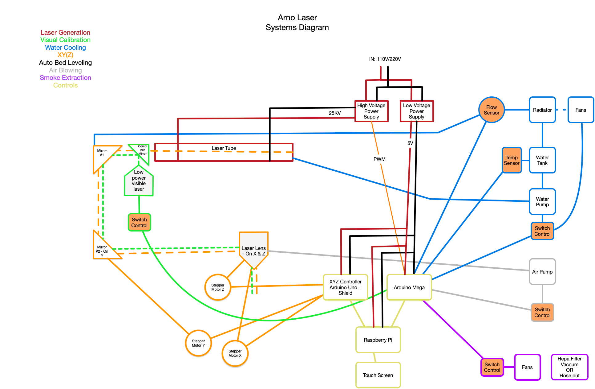

# Arno Laser
Arno Laser is a DIY Laser Cutter kit designed to be ready to use and includes software &amp; hardware.

*Status as of Sept 2018*

*CAD Picture*

## Features
This laser cutter is to include inside its case:

- a 45W Laser tube of high quality,

- a cutting bed of min 500mm x 300mm, 

- a xy(z) system,

- a powersupply for the laser (high voltage),

- an air system (to blow the smoke out of the laser's way),

- a water cooling system (to protect the laser tube),

- a smoke extraction system (to either a HEPA filter or outside),

- an efficient moving system (wheels, and all shock absorbing system to protect internal parts)

- a computing unit and a touch screen to control all aspect of the Laser

## System Diagram

# Objectives & Roadmap
The goal of this design is to create a Laser Cutter kit that can be assembled at home/office/school with a limited amount of tools.

To achieve this goal, I will leverage at maximum stock parts and 3D printed parts.
